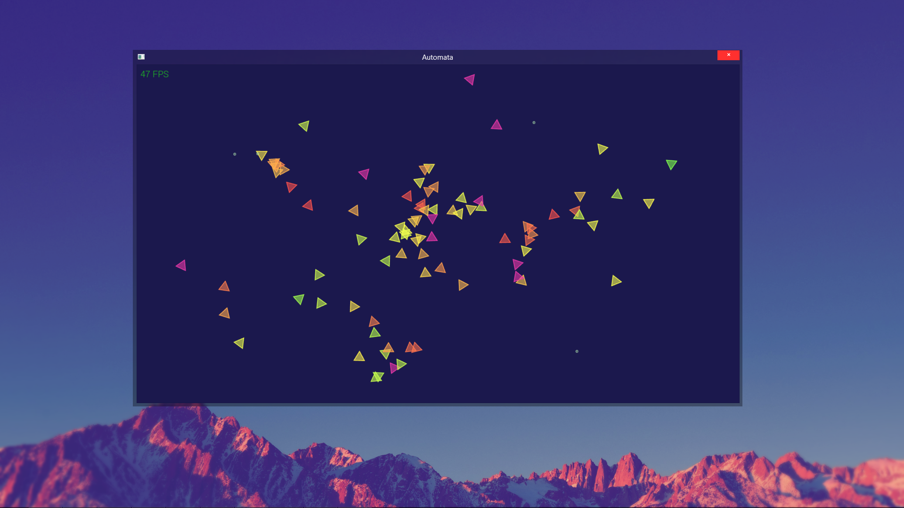
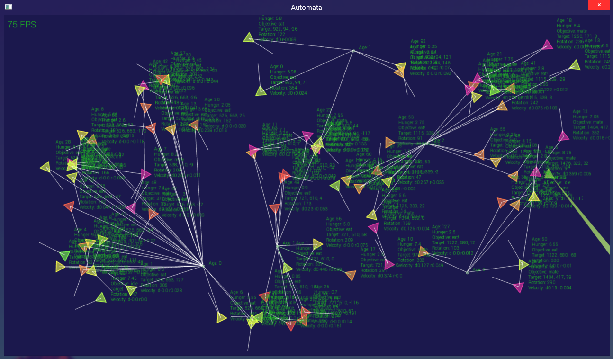

# Automata
A simulation. Consider it a digital fishtank.

## About
A micro version to Conway's macro version of the Game of Life.

Conway's Game of Life is meant to simulate the rise and fall of an ecosystem in all their various cycles, with each cell representing an ecosystem.

This project is meant to represent the same concept, but as every individual within an ecosystem rather than every ecosystem in a planet; Same analogues, smaller scale.

Conway tried to represent the behavior and nature of self balancing populations in life by reducing it to it's minutiae, it's absolutes. All the complexities of life boiled down to a mathematical formula. By contrast, every unit within this program is meant to represent a function of life so small, they approximate that of Phytoplankton, or bacterium.

Functions of life so small, they can hardly be called life so much as simple sets of instructions, logic gates, and programmed operations.

You might call them Robots. Or, if you will, [***Automata***](http://www.dictionary.com/browse/automata).

## Todo

- [ ] Begin rewrite in Rust
- [ ] Fix mutuation behavior
- [ ] Create distributable binary releases
- [ ] Sine wave animation for locomotion behaviors
